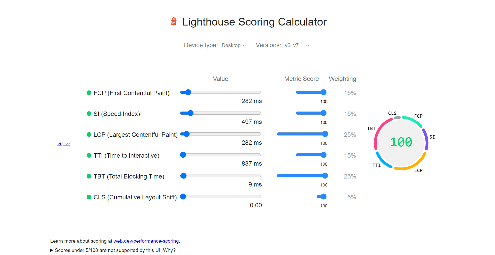
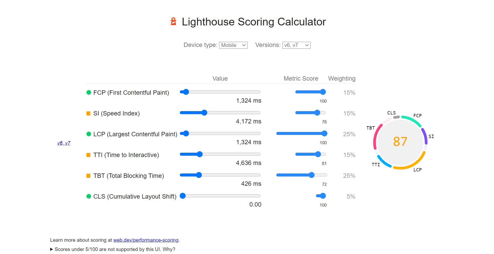

# Sequelian - An online SQL Query generator by Lelianto

An online sql editor made with [nuxt](https://nuxtjs.org/), [element-ui](element.eleme.i), [tailwind](https://tailwindcss.com/docs), [nuxt-content](https://github.com/nuxt/content) and [nuxt-highlight.js](https://www.npmjs.com/package/nuxt-highlightjs) for syntax highlighting.

[](https://app.netlify.com/sites/sequelian/deploys)

## Build Setup

```bash
# install dependencies
$ npm install

# serve with hot reload at localhost:3000
$ npm run dev

# build for production and launch server
$ npm run build
$ npm run start

# generate static project
$ npm run generate
```

For detailed explanation on how things work, check out [Nuxt.js docs](https://nuxtjs.org).

# Page Load Time

I have tested page load time using lighthouse in google chrome.
I have done the following things to optimize page performance.

- We import the code for the components that we are using. We import it dynamically in index.vue page. To avoid making our application worse by actually making it better and adding new features we just need to make separate bundles for each route using dynamic import syntax. Only the code from route that is currently visited by the user will be downloaded.
- Using the Tailwind CSS we configure it to only download the packages we use. Using tailwind config purgecss to remove unwanted css class.
- Implement some of Vue best pratices from [vue-school](https://vueschool.io/articles/series/vue-js-performance/).

Below are results for various matrices before and after optimizations.

### Desktop

| Item                           | Before   | After    |
| ------------------------------ | -------- | -------- |
| FCP (First Contentful Paint)   | 324  ms  | 282  ms  |
| SI (Speed Index)               | 535  ms  | 497  ms  |
| LCP (Largest Contentful Paint) | 324  ms  | 282  ms  |
| TTI (Time to Interactive)      | 867  ms  | 837  ms  |
| TBT (Total Blocking Time)      | 47   ms  | 9    ms  |
| CLS (Cumulative Layout Shift)  | 0.00 ms  | 0.00 ms  |

Screenshot:


### Mobile

| Item                           | Value    | After    |
| ------------------------------ | -------- | -------- |
| FCP (First Contentful Paint)   | 2,124 ms | 1,324 ms |
| SI (Speed Index)               | 5,219 ms | 4,172 ms |
| LCP (Largest Contentful Paint) | 3,044 ms | 1,324 ms |
| TTI (Time to Interactive)      | 3,569 ms | 4,636 ms |
| TBT (Total Blocking Time)      | 330   ms | 426   ms |
| CLS (Cumulative Layout Shift)  | 0.00  ms | 0.02  ms |

Screenshot:

